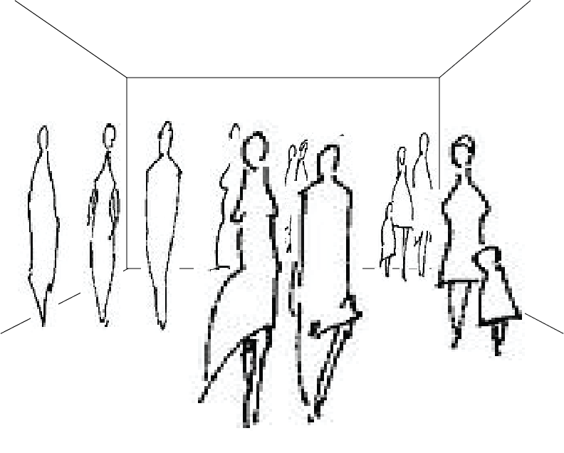

## Music Fits Room
*Music Fits Room* is an interactive musical experience inspired by *Madonna's Sky Fits Heaven*. Based on the song, it's [Catalog of Attributes](https://makingmusic.ableton.com/catalog-of-attributes) and randomly selected [oblique strategies](https://www.joshharrison.net/oblique-strategies/) of **organic machinery** we imagined a room or space where the elements of music are layered as the occupancy of the room changes. For example, if the space is empty only echoing electronic swooshes and trills are heard. With a small group of people a rhythmic layer (synth & drum pattern) is added. A medium size group would have melodic + vocals layered in. Finally with a large group, drum flourishes and breaks are added for a full on dance party. The walls could metaphorically reflect the complixity of the music with complexity of visuals.

